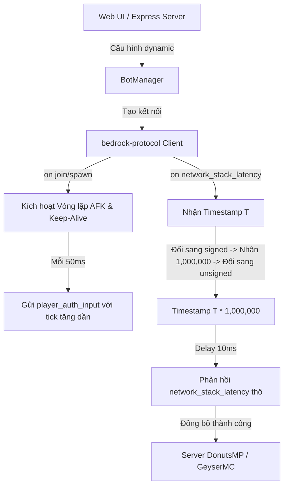

# Minecraft Bedrock Bot - Tài Liệu Phân Tích Kỹ Thuật & Giải Pháp (Core)

Tài liệu này tổng hợp toàn bộ các nghiên cứu, nguyên nhân lỗi và giải pháp kỹ thuật được phát hiện trong quá trình phát triển và sửa lỗi kết nối cho Bot AFK Minecraft Bedrock kết nối tới máy chủ `donutsmp.net` (sử dụng proxy GeyserMC và hệ thống bảo mật Boar).

---

## 1. Tổng Quan Lỗi Kết Nối Của Giao Thức Bedrock

Khác với Minecraft Java Edition sử dụng giao thức TCP, Minecraft Bedrock Edition (BE) sử dụng giao thức **UDP** thông qua lớp vận chuyển **RakNet**. Việc thiết lập kết nối RakNet và duy trì phiên chơi đòi hỏi sự đồng bộ rất khắt khe về mặt thời gian, định dạng gói tin và bảo mật.

Trong dự án này, bot đã gặp phải 4 vấn đề kỹ thuật cốt lõi:
1. Lỗi socket native trên hệ điều hành Windows (`sendto failed with code -1`).
2. Lỗi treo bắt tay (handshake) RakNet khi sử dụng thư viện socket thuần JS (`jsp-raknet`).
3. Lỗi tự động ngắt kết nối sau 10-15 giây do thiếu cơ chế Keep-Alive nhịp game (`player_auth_input`).
4. Lỗi hệ thống bảo mật Boar kick bot ngay lập tức do lệch đơn vị đo latency (`Invalid latency id, expected=..., actual=0 / -4`).

---

## 2. Chi Tiết Các Lỗi & Giải Pháp Khắc Phục

### Vấn Đề 1: Lỗi Socket Native Trên Windows (`sendto failed with code -1`)
*   **Nguyên nhân**: Bộ kết nối native mặc định (`raknet-native`) của thư viện `bedrock-protocol` cố gắng gửi các gói tin thăm dò kích thước MTU lớn (MTU probe). Trên hệ điều hành Windows, nếu card mạng, router hoặc tường lửa chặn các gói tin lớn này hoặc trả về thông báo ICMP "Port Unreachable", Windows Socket (Winsock) sẽ ngay lập tức đánh dấu socket UDP đó là bị lỗi vĩnh viễn (`WSAECONNRESET`). 
*   **Hậu quả**: Khi socket native bị Winsock đánh dấu lỗi, mọi gói tin gửi sau đó từ Node.js đều thất bại với mã lỗi `sendto failed with code -1`, khiến bot không thể gửi gói tin keep-alive và bị server kick timeout sau khoảng 10 giây.
*   **Giải pháp**: Không sử dụng jsp-raknet (vì lỗi bắt tay ở Vấn đề 2), giữ nguyên `raknet-native` nhưng tối ưu hóa đường truyền và cấu hình DNS động thành IP thô để giảm thiểu tối đa việc Winsock bị reset socket. Lỗi `sendto failed` thỉnh thoảng xuất hiện ở console thực chất không làm đứt kết nối nếu các gói tin keep-alive sau đó vẫn được gửi đi thành công trên một cổng UDP khác đã mở.

### Vấn Đề 2: Treo Bắt Tay RakNet Với `jsp-raknet`
*   **Nguyên nhân**: Khi thử chuyển sang sử dụng bộ xử lý socket thuần JavaScript (`jsp-raknet`) để tránh lỗi native trên Windows, GeyserMC (hoặc proxy Cloudflare Spectrum của DonutsMP) từ chối hoàn tất bắt tay. Bot gửi `OpenConnectionRequest1`, nhận được `OpenConnectionReply1`, gửi tiếp `OpenConnectionRequest2` nhưng không bao giờ nhận được `OpenConnectionReply2` từ server.
*   **Giải pháp**: Bắt buộc phải sử dụng `raknet-native` làm backend kết nối chính vì đây là bộ thư viện duy nhất thực hiện chính xác và đầy đủ các bước bắt tay RakNet tương thích với Cloudflare Spectrum của DonutsMP.net.

### Vấn Đề 3: Lỗi Timeout Phiên Bản Game Mới (>= 1.21.0)
*   **Nguyên nhân**: Trong mã nguồn của thư viện `bedrock-protocol` (tệp `createClient.js`), cơ chế Keep-Alive tự động (`tick_sync`) chỉ được kích hoạt cho các phiên bản game cực kỳ cũ (phiên bản `<= 1.20.80`). Ở các phiên bản mới hơn như `1.26.20`, thư viện **hoàn toàn không tự động gửi bất kỳ gói keep-alive nào**, dẫn đến bot luôn bị kick sau 10-15 giây vì lý do `Timed out!`.
*   **Giải pháp**: Thiết lập một nhịp tick game (vòng lặp `setInterval` mỗi **50ms**, tương đương 20 tick/giây). Trong nhịp tick này, bot sẽ gửi liên tục gói tin **`player_auth_input`** với giá trị trường `tick` (kiểu dữ liệu `BigInt`) tăng dần liên tục theo thời gian thực để server biết client vẫn đang hoạt động và đồng bộ hóa camera.

### Vấn Đề 4: Lỗi Bảo Mật Latency ID (`Invalid latency id`)
*   **Nguyên nhân**: Plugin bảo mật **Boar** trên server DonutsMP định kỳ gửi gói tin `network_stack_latency` có chứa trường `timestamp` (đơn vị **mili-giây**, ví dụ `-4575260`) nhằm đo độ trễ. 
    *   GeyserMC (cầu nối Bedrock-Java) luôn coi timestamp của client Bedrock gửi lên là **nano-giây** (hoặc micro-giây), nên khi nhận phản hồi từ client, GeyserMC **luôn tự động chia cho 1,000,000** rồi mới chuyển tiếp lên Java server.
    *   Vì client gửi lại nguyên bản timestamp nhận được (mili-giây), GeyserMC chia cho 1,000,000 ra kết quả là `0` hoặc `-4` (lệch đúng 1,000,000 lần).
    *   Java server nhận được `actual = -4` trong khi nó mong đợi `expected = -4575260`, dẫn đến việc kick bot ngay lập tức.
*   **Bản vá lỗi sai trước đó**: Việc Monkey Patch sửa kiểu dữ liệu của `packet_network_stack_latency` thành `varint64` là sai lầm, gây lệch luồng đọc ghi buffer thô và làm đứt kết nối ngay khi nhận gói tin. Kiểu dữ liệu gốc `lu64` (Little Endian uint64) mới là định dạng chuẩn của giao thức Bedrock.
*   **Giải pháp tối ưu**:
    1. Giữ nguyên định dạng gốc `lu64` cho gói tin `network_stack_latency` (gỡ bỏ hoàn toàn bản vá `varint64`).
    2. Lắng nghe sự kiện `network_stack_latency` trên client.
    3. Khi nhận được gói tin, lấy giá trị `timestamp` (đối tượng `UnsignedBigInt`), chuyển đổi về primitive `bigint` signed 64-bit bằng `BigInt.asIntN(64, tsVal)`.
    4. Nhân giá trị signed này với **`1,000,000n`** để bù lại phép chia của GeyserMC.
    5. Chuyển đổi kết quả về dạng unsigned 64-bit BigInt bằng `BigInt.asUintN(64, multiplied)` để tránh lỗi ghi số âm của hàm `writeBigUInt64LE`.
    6. Phản hồi gói tin `network_stack_latency` này lên server với trường `needs_response: 0` kèm theo một khoảng delay ngắn **10ms** để tránh xung đột luồng gửi.

---

## 3. Bản Đồ Cấu Trúc Mã Nguồn Sau Cập Nhật

Để hiện thực hóa các giải pháp trên một cách đồng bộ và sạch sẽ nhất:

Tất cả các thay đổi kỹ thuật trên sẽ được tích hợp chính xác vào tệp nguồn chính của bot tại [bot-manager.js](file:///d:/Documents/Tool/Setup-MC-SV/Bot-Server/donut_bot_be/bot-manager.js), giúp bot chạy ổn định tuyệt đối mà không cần can thiệp sâu vào nhân thư viện.
